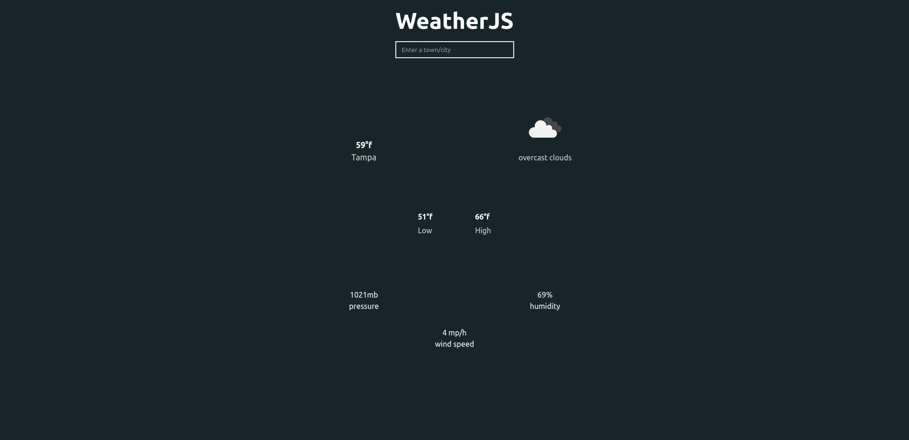

## Project Title

WeatherJS WebApp

## Demo Link:

Access my site at [Demo Link](https://neptunerjo.github.io/weatherjs/)

## Table of Content: 

- [About The App](#about-the-app)
- [Screenshots](#screenshots)
- [Technologies](#technologies)
- [Setup](#setup)
- [Approach](#approach)

## About the App

WeatherJS is a web app built with React utilizing OpenWeather API to display the current weather.
It displays the current temperature, the weather, the highs and lows for the day, and current pressure, humidity, and windspeed.

## Screenshots

## Technologies

Built using `html`, `css`, `React`, and `OpenWeather API`.
Tested with `React-Testing-Library` and `Jest`.

## Setup

- Download or clone the repository
- Run `npm install`
- Run `npm start` to view a local version on `http://localhost:3000/`

## Approach

React `props` and `hooks` were necessary to make this app function.
`props` were used to pass the location to the API, and the data fetched to the body
sessionStorage allows for persistance on refresh, for increased usability

